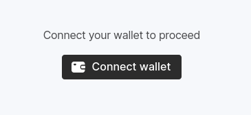
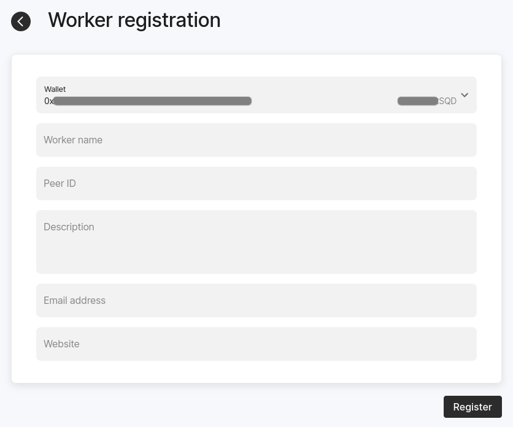

# 🦑 Bir Worker Çalıştırın
[Docs (EN)](https://docs.sqd.dev/subsquid-network/participate/worker/)

Rehberdeki yönergeler ve kurulum Ubuntu 22.04 LTS üzerinde test edilmiştir.

## Gereksinimler 
Tek bir worker çalıştırmak için ihtiyacınz olanlar:

* 4 vCPU
* 16GB RAM
* 1TB SSD
* 7/24 stabil çalışan minimum 1Gbit internet bağlantısı.
* ***docker*** + ***docker-compose***
* Kamuya açık IP adresi (2 açık port ile):
  - UDP portu: P2P iletişimi için (varsayılan: 12345)
  - TCP portu: Prometheus metrikleri için (varsayılan: 9090)
* `100_000` ***SQD*** token (cüzdanınızda veya özel "vesting contract"
  içerisinde)
* Gas ücretleri için Arbitrum ETH

**SQD** tokenleri *Birincil Cüzdanınızda* mevut olmalıdır.
Birincil Cüzdanınızın tarayacıyı desteklemesi gerekiyor. Biz Metamask'i 
öneriyoruz.


## Docker Kurulumu
> Sunucuya SSH ile bağlandıktan sonra

### 1) Sistem güncellemesi:
```
sudo apt-get update && sudo apt-get upgrade -y

```

### 2) Docker GPG Anahtarının eklenmesi:
```
sudo apt-get install ca-certificates curl gnupg
sudo install -m 0755 -d /etc/apt/keyrings
curl -fsSL https://download.docker.com/linux/ubuntu/gpg | sudo gpg --dearmor -o /etc/apt/keyrings/docker.gpg
sudo chmod a+r /etc/apt/keyrings/docker.gpg
```

### 3) Docker Kaynağının Kütüphaneye Eklenmesi ve  Güncellenmesi:
```
echo \
  "deb [arch=$(dpkg --print-architecture) signed-by=/etc/apt/keyrings/docker.gpg] https://download.docker.com/linux/ubuntu \
  $(. /etc/os-release && echo "$VERSION_CODENAME") stable" | \
  sudo tee /etc/apt/sources.list.d/docker.list > /dev/null
sudo apt-get update
```

### 4) Docker ve Diğer Gereksinimleri İndirilmesi
```
sudo apt-get install docker-ce docker-ce-cli containerd.io docker-buildx-plugin docker-compose-plugin
```

### 5) Sistem Başlangıcında Docker'ın Otomatik Açılması
```
sudo systemctl enable --now docker
```

### 6) Docker Versiyonunu Kontrol Edilmesi
```
docker --version
```

[Worker Kurulumu](#worker-kurulumu) ile devam edin.


## Worker Kurulumu
Worker Verisi klasörü (<DATA_DIR_PATH>) için bir dosya yolu bulun. (ÖR:
`~/worker_data`)
Klasörü kendiniz oluşturmayın, sadece yer bulun.

SQD Network anahtar dosyası (<KEY_PATH>) için bir dosya yolu bulun. (ÖR:
`~/sqd_key`) 
Bu dosya yolu Worker Verisi klasörü içinde OLMAMALIDIR.

> **UYARI**: Anahtarın yanlışlıkla silinmeyeceğinden ve yetkisiz taraflarca erişilemeyeceğinden emin olun.

### 1) Yeni bir klasör oluşturup `setup_worker.sh` dosyasını indirin.

```
mkdir worker_setup && cd worker_setup
curl -fO https://cdn.subsquid.io/worker/setup_worker.sh
```

### 2) Dosyayı çalıştırılabilir hale getirin.

```
chmod +x ./setup_worker.sh
```

### 3) Kurulum dosyasını çalıştırın.
```
./setup_worker.sh <DATA_DIR_PATH> <KEY_PATH>
```
Komut dosyası sizden P2P iletişimi için kullanılacak bir UDP bağlantı noktası
isteyecek ve worker config'teki genel IP adresinizi statik olarak ayarlamanız
için bir seçenek sunacaktır. Otomatik IP bulma özelliğine sahip kurulumlar daha
sağlam olduğundan çoğu kullanıcı IP adresini burada AYARLAMAMALIDIR.

Kurulum dosyası:
- `<DATA_DIR_PATH>` dosya yolunda bir klasör oluşturur.
- `<KEY_PATH>` dosya yolunda yeni bir anahtar dosyası yaratır.
- `.env` dosyası yaratır ve varsayılanları ekler.
- `.mainnet.env` dosyası indirir.
- `docker-compose.yaml` dosyası indirir.

Kurulum dosyasının indirdiği tüm dosyalara
[buradan](https://github.com/subsquid/cdn/tree/main/src/worker) erişebilirsiniz. 

Kurulum dosyası çıktısının sonucunda son satır aşağıdaki gibi görünmelidir:
```
Your peer ID is: 12D3KooWPfotj6qQapKeWg4RZysUjEeswLEpiSjgv16LgNTyYFTW. Now you can register it on chain.
```
Lütfen peer ID'nizi kopyalayın. Chain üzerinden Worker kaydında ihtiyacımız
olacak.

[Worker'ı Kayıt Edin](#worker%C4%B1-kay%C4%B1t-edin) ile devam edin.

## Worker'ı Kayıt Edin
Worker node çalıştırmadan önce, web aplikasyonumuzu kullanarak chain üzerine
kaydetmeniz gerekiyor. İşte adımlar:

1. https://network.subsquid.io adresine gidin.

2. Birincil cüzdanınızı ekleyin.

   

3. "Workers" sekmesine gidin ve "Add Worker" butonuna tıklayın. Ardından Worker
   kayıt formu görmelisiniz:

   

4. Formu doldurun ve bir işlem imzalayarak gönderin. 
   - Aşağı doğru açılan menüde, "Wallet" (Cüzdanınızdan direkt **SQD** kullanmak
     için) veya "Vesting contract" (Hakediş sözleşmesinden **SQD** kullanmak
     için) seçin.
   - "Kurulum dosyası çalıştırın" bölümünde kopyaladığınız peer ID'yi kullanın.

5. "Workers" sekmesine gidin ve kaydettiğiniz worker'ın durumu "Offline" veya
   "Active" olana kadar bekleyin. Workerlar sadece [epoch]() başlangıcında
   aktive olabildiği için, bir kaç dakika beklemeniz gerekiyor.

[Worker'ı Çalıştırın](#worker%C4%B1-%C3%A7al%C4%B1%C5%9Ft%C4%B1r%C4%B1n) ile devam edin.

## Worker'ı Çalıştırın
Hala `worker_setup` isimli klasörde olduğunuzdan emin olun.
Komutu çalıştırın:
```
docker compose up -d
```
Ardından `docker compose logs` ile worker konteynerin kayıtlarını kontrol edin.
Bir süre sonra, worker indirilen veri parçaları hakkında bazı bilgiler
çıkarmalıdır.

## Worker Güncelleme 
Bazen workerınızı güncellemeniz gerekebilir. Bunun için standart prosedür:

1. Anahtar dosyanızı yedekleyin. 
2. `worker_setup` isimli klasörünüze gidin.
3. Güncellenmiş `docker-compose.yaml` dosyasını indirin.
```
curl -fO https://cdn.subsquid.io/worker/docker-compose.yaml
```
4. Ardından güncellemek için komutu çalıştırın:
```
docker compose up -d
```

## On jailing
***devam eden çalışma***

## Sorun Giderme
***devam eden çalışma***
